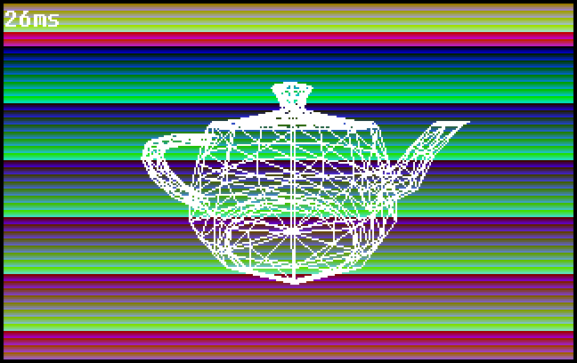

# os

A toy 32-bit operating system for x86. No shell, no filesystem, no scheduling; just an excercise in x86 with a spinning teapot.




## Features
- 32-bit
- 320x200 8-bit color
- PS/2 keyboard and mouse


## Quick Start
Requirements:
- GNU coreutils (`make`, `cat`, `dd`)
- GNU gcc for i386 (`i386-elf-gcc`, `i386-elf-ld`)
- NASM (`nasm`)
- QEMU (`qemu-system-i386`)


```sh
$ make run
```


## Resources
##### Primary information
- OSDev wiki: https://wiki.osdev.org/
- Writing a Simple Operating System - from Scratch: https://www.cs.bham.ac.uk/~exr/lectures/opsys/10_11/lectures/os-dev.pdf
- Carlos Fenollosa's "os-tutorial": https://github.com/cfenollosa/os-tutorial
- Intel x86 Manuals: https://www.intel.com/content/www/us/en/developer/articles/technical/intel-sdm.html
- The little book about OS development: https://littleosbook.github.io/
- Roll your own toy UNIX-clone OS: http://jamesmolloy.co.uk/tutorial_html
##### Notable YouTube videos/playlists
- jdh - tetris-os: https://www.youtube.com/watch?v=FaILnmUYS_U
- Andreas Kling - SerenityOS: https://www.youtube.com/playlist?list=PLMOpZvQB55bczV5_3DxTLDm37v_F6iCKA
- Poncho -
    - OS Dev: https://www.youtube.com/playlist?list=PLxN4E629pPnKKqYsNVXpmCza8l0Jb6l8-
    - OS Dev - S2: https://www.youtube.com/playlist?list=PLxN4E629pPnJxCQCLy7E0SQY_zuumOVyZ
- nanobyte - Building an OS: https://www.youtube.com/playlist?list=PLFjM7v6KGMpiH2G-kT781ByCNC_0pKpPN
- Queso Fuego - Ameateur Makes an OS: https://www.youtube.com/playlist?list=PLT7NbkyNWaqajsw8Xh7SP9KJwjfpP8TNX

